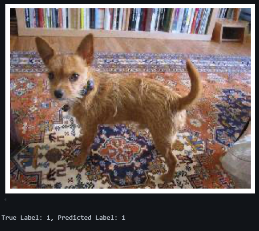
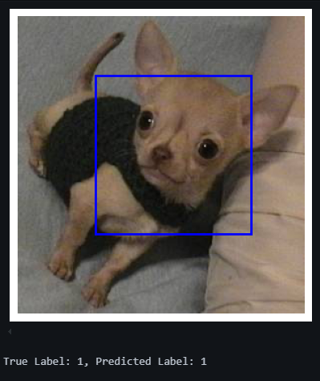
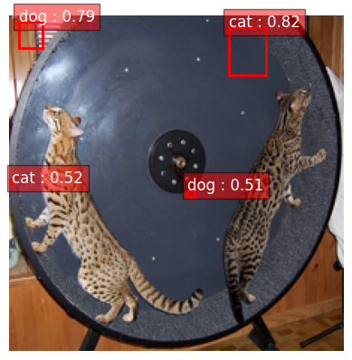
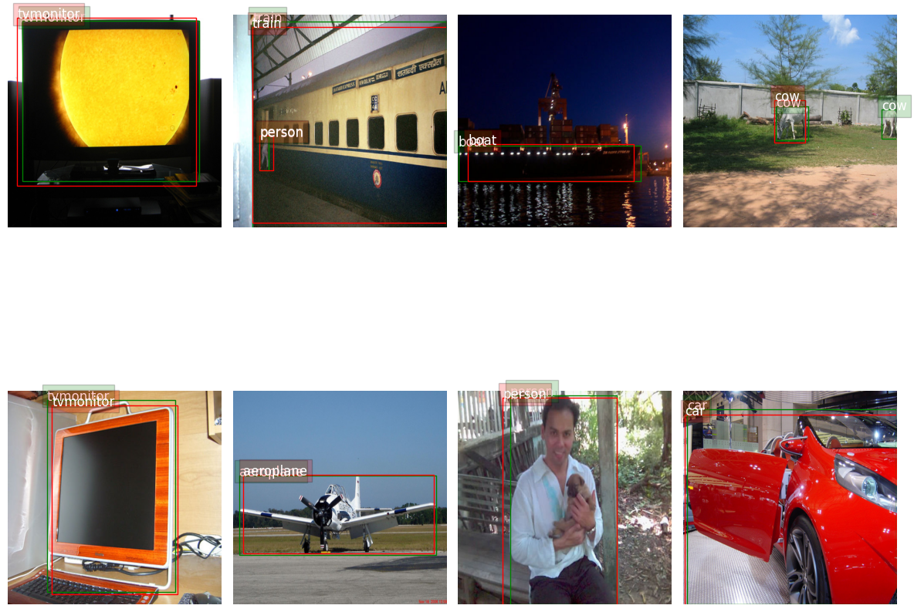

# Object Detection and Classification Models

This repository contains various Jupyter notebooks that demonstrate different techniques for object detection and classification in images. The models cover single object classification, object classification with bounding box localization, and multi-object detection with bounding box localization, along with a YOLOv1 implementation.

## Notebooks Overview

1. **Classification (Single Object in Image) - `classification.ipynb`**
   - This notebook demonstrates the classification of a single object in an image using a standard classification model.
   - The model predicts the class of the object present in the image.

2. **Classification (Single Object) + Localization (Bounding Box) - `class_bbox_reg.ipynb`**
   - This notebook extends the previous classification model by adding the ability to localize the object within the image.
   - The model predicts both the class label and the bounding box coordinates for the object.

3. **Classification (Multiple Objects in Image) + Localization (Bounding Box) - `class_bbox_reg_2obj.ipynb`**
   - This notebook handles cases where there are multiple objects in the image.
   - It classifies each object in the image and provides a bounding box for each object, enabling multi-object detection and localization.

4. **YOLOv1 - `yolov1.ipynb`**
   - This notebook implements YOLOv1 (You Only Look Once), a popular object detection model.
   - YOLOv1 performs both classification and localization by predicting bounding boxes and class probabilities for all objects in the image in a single pass.

## Setup

1. Clone the repository:
```bash
git clone https://github.com/linhlinhle997/object-detection-techniques.git
cd object-detection-techniques/od_part1
```
2. Open the notebook using Jupyter or Google colab:
```bash 
jupyter notebook
```
3. Follow the instructions in each notebook to load data, train models, and evaluate the results.

## Result

1. **Classification (Single Object in Image) - `classification.ipynb`**



2. **Classification (Single Object) + Localization (Bounding Box) - `class_bbox_reg.ipynb`**



3. **Classification (Multiple Objects in Image) + Localization (Bounding Box) - `class_bbox_reg_2obj.ipynb`**



4. **YOLOv1 - `yolov1.ipynb`**


