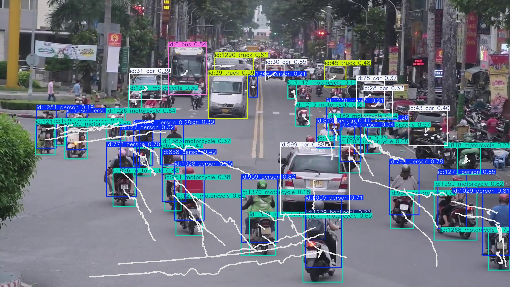
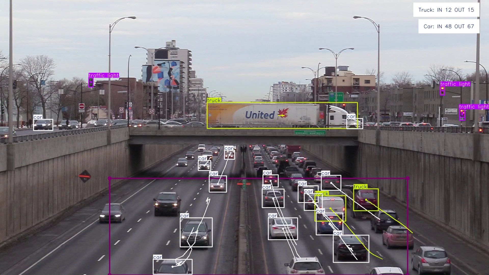
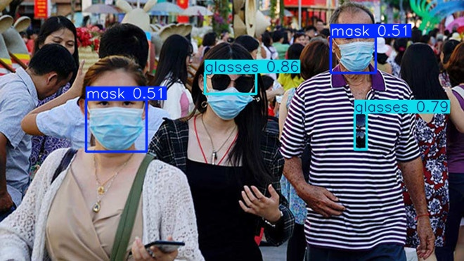
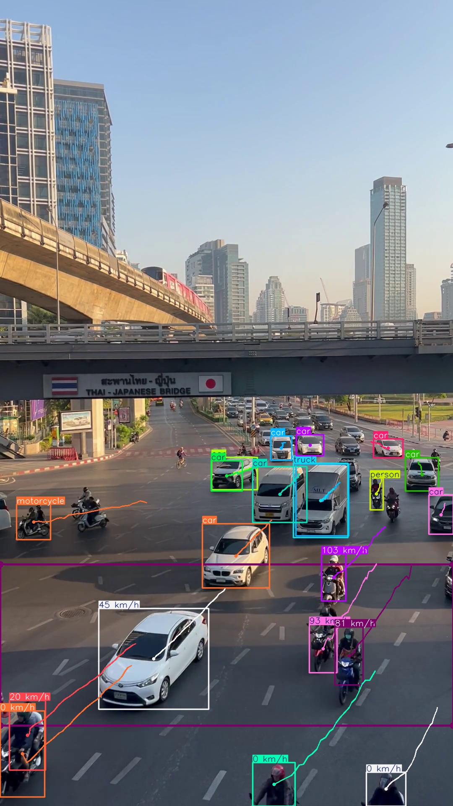

# AI-Based Object Detection and Estimation Projects

This repository contains implementations of four distinct AI-powered projects, each solving a unique problem in the domain of computer vision and speech estimation. These projects utilize state-of-the-art models and frameworks to deliver efficient and accurate results.

---

## Overview

This repository showcases implementations of advanced AI solutions:
- **Object Tracking:** Detect and follow objects across video frames.
- **Object Counting:** Count objects appearing in a specific region of a video.
- **Open Vocabulary Detection:** Identify objects based on custom, user-defined labels.
- **Vehicle Speed Estimation:** Analyze and estimate the speed of vehicles.

Each project includes two versions:
- **Simple:** A straightforward implementation for ease of understanding.
- **Optimized:** Processes data in batches for enhanced performance and scalability.

---

## Setup

1. Clone the repository:
```bash
git clone https://github.com/linhlinhle997/object-detection-techniques.git
cd object-detection-techniques/od_part2
```
2. Install dependencies:
```bash
pip install -r requirement.txt
```

---

## Projects

### 1. Object Tracking

**Description:**  
Tracks objects across video frames by using the YOLO model for object detection and associating detected objects frame by frame.

**Key Features:**
- Tracks multiple objects simultaneously.
- Uses bounding boxes and object IDs for seamless tracking.
- Outputs an annotated video with tracking overlays.

**Model Used:**  
`yolo11l.pt`

**Usage**

- Simple Version:
```bash
python -m src.object_tracking.simple
```

- Optimized Version (Batch Processing):
```bash
python -m src.object_tracking.optimized
```

**Result**




---

### 2. Object Counting

**Description:**  
Counts the number of objects entering a user-defined region in a video.

**Key Features:**
- Region-based counting using polygons.
- Outputs processed video with counting overlays.
- Handles dynamic object movements.

**Model Used:**  
`yolo11x.pt`

**Usage**

- Simple Version:
```bash
python -m src.object_counting.simple
```

- Optimized Version (Batch Processing):
```bash
python -m src.object_counting.optimized
```

**Result**



---

### 3. Open Vocabulary Detection

**Description:**  
Detects objects in images based on custom classes defined by the user, without being restricted to a fixed set of labels.

**Key Features:**
- Supports user-defined custom object classes.
- Works with the pre-trained **YOLO-World** model for open vocabulary detection.
- Flexible and no retraining required for new labels.

**Model Used:**  
`yolov8x-world.pt`

**Usage**
```bash
python -m src.open_vocab_detection
```

**Result**




---

### 4. Vehicle Speech Estimation

**Description:**  
Estimates the speed of vehicles in video streams. This tool analyzes object movements frame by frame and calculates their speeds.

**Key Features:**
- Accurately estimates vehicle speed in real-time or from pre-recorded video.
- Outputs an annotated video displaying speed information.
- Supports batch processing for improved performance.

**Model Used:**  
`yolo11n.pt`

**Usage**

- Simple Version:
```bash
python -m src.speech_estimation.simple
```

- Optimized Version (Batch Processing):
```bash
python -m src.speech_estimation.optimized
```

**Result**


